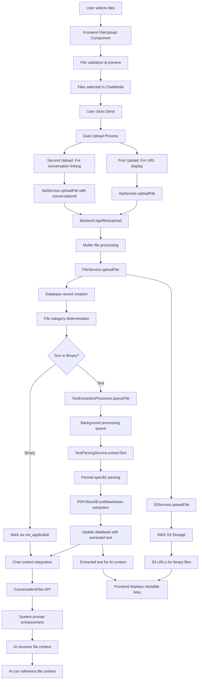

# Skillbox File Upload System - Vollständige Dokumentation

## 📋 Inhaltsverzeichnis

1. [Überblick](#überblick)
2. [Architektur](#architektur)
3. [Implementierte Features](#implementierte-features)
4. [Unterstützte Dateitypen](#unterstützte-dateitypen)
5. [Text-Extraktion](#text-extraktion)
6. [Chat-Integration](#chat-integration)
7. [API-Endpunkte](#api-endpunkte)
8. [Frontend-Komponenten](#frontend-komponenten)
9. [Konfiguration](#konfiguration)
10. [Beschränkungen](#beschränkungen)
11. [Offene Punkte](#offene-punkte)
12. [Troubleshooting](#troubleshooting)

---

## 🎯 Überblick

Das Skillbox File Upload System ermöglicht es Benutzern, Dateien hochzuladen, die automatisch in AWS S3 gespeichert, bei Bedarf textextrahiert und in Chat-Konversationen integriert werden. Das System unterstützt sowohl Text-Dateien (für Kontext-Integration) als auch binäre Dateien (für Automatisierung und externe Verarbeitung).

### Kernfunktionen
- ✅ **Multi-Format Upload**: Unterstützung für 15+ Dateitypen
- ✅ **AWS S3 Integration**: Sichere Cloud-Speicherung
- ✅ **Automatische Text-Extraktion**: Intelligente Inhaltsanalyse
- ✅ **Chat-Kontext Integration**: AI kann auf Dateiinhalte zugreifen
- ✅ **Token-Management**: Berücksichtigung bei Kontext-Limits
- ✅ **Klickbare Links**: Elegante UI mit direkten S3-URLs

---

## 🏗️ Systemarchitektur & Vollständiger Datenfluss

### **Komplette System-Pipeline**



### **Systemische Layer-Architektur**

#### **1. Frontend-Layer (React/TypeScript)**

**FileUpload.tsx Komponente:**
```typescript
// Drag & Drop Interface mit umfassender Validierung
const FileUpload: React.FC<FileUploadProps> = ({
  maxFiles = 5,
  maxSize = 10, // MB
  allowedTypes = [
    'image/*', 'text/*', 'audio/*', 'video/*',
    'application/pdf', 'application/msword',
    'application/vnd.openxmlformats-officedocument.wordprocessingml.document',
    'application/vnd.ms-excel',
    'application/vnd.openxmlformats-officedocument.spreadsheetml.sheet',
    'application/vnd.ms-powerpoint',
    'application/vnd.openxmlformats-officedocument.presentationml.presentation',
    'application/zip', 'application/x-zip-compressed'
  ]
}) => {
  // Validierung, Preview-System, Progress-Tracking
};
```

**ChatModalWithHistory.tsx - Dual-Upload-System:**
```typescript
const handleSend = async () => {
  if (selectedFiles.length > 0) {
    // DUAL UPLOAD SYSTEM - Beide Uploads sind notwendig!
    
    // 1. Erster Upload: Für URL-Anzeige in User-Message
    const uploadPromises = selectedFiles.map(file => 
      ApiService.uploadFile(file, selectedConversation?.id)
    );
    const uploadResults = await Promise.all(uploadPromises);
    
    // 2. Markdown-Links für klickbare Dateinamen
    const fileInfos = uploadResults.map((result: any, index: number) => {
      if (result.success && result.data) {
        return `📎 [${result.data.originalName}](${result.data.s3Url})`;
      } else {
        return `❌ ${selectedFiles[index].name} (Upload fehlgeschlagen)`;
      }
    }).join('\n');
    
    finalMessage = `${message}\n\n${fileInfos}`;
  }
  
  // 3. Zweiter Upload erfolgt automatisch durch safeSendMessage
  await safeSendMessage(finalMessage, selectedFiles);
};
```

#### **2. Backend-API-Layer (Express.js/Node.js)**

**Multer Middleware Konfiguration:**
```typescript
const upload = multer({
  storage: multer.memoryStorage(),
  limits: {
    fileSize: 50 * 1024 * 1024, // 50MB Limit
  },
  fileFilter: (req, file, cb) => {
    // Alle Dateitypen erlaubt - Validierung erfolgt im Frontend
    cb(null, true);
  },
});
```

**Files Router (/api/files/upload) - Vollständiger Workflow:**
```typescript
router.post('/upload', authenticateTokenStandard, upload.single('file'), async (req, res) => {
  // 1. Authentication & Validation
  if (!isAuthenticated(req) || !req.file) return res.status(400);
  
  // 2. File Service Upload
  const uploadResult = await fileService.uploadFile({
    originalName: req.file.originalname,
    buffer: req.file.buffer,
    contentType: req.file.mimetype,
    uploadedBy: req.user.userId,
    metadata: { uploadedVia: 'api', userAgent: req.get('user-agent'), ip: req.ip }
  });
  
  // 3. Conversation Linking (wenn conversationId vorhanden)
  if (conversationId) {
    await fileService.attachFileToConversation(conversationId, uploadResult.file.id, req.user.userId, 'upload');
  }
  
  // 4. Text Extraction Queue (nur für Text-Dateien)
  if (uploadResult.file.file_category === 'text') {
    await textExtractionProcessor.queueFile(
      uploadResult.file.id, uploadResult.s3Key, 
      uploadResult.file.content_type, uploadResult.file.original_name, 'normal'
    );
  }
});
```

#### **3. Service-Layer (Geschäftslogik)**

**FileService - Zentrale Koordination:**
```typescript
class FileService {
  // Kategorie-Bestimmung basierend auf MIME-Type und Extension
  private determineFileCategory(contentType: string, originalName: string): 'text' | 'binary' {
    const textTypes = [
      'text/plain', 'text/markdown', 'application/pdf',
      'application/msword', 'application/vnd.openxmlformats-officedocument.wordprocessingml.document',
      'application/vnd.ms-powerpoint', 'application/vnd.openxmlformats-officedocument.presentationml.presentation',
      'application/vnd.ms-excel', 'application/vnd.openxmlformats-officedocument.spreadsheetml.sheet'
    ];
    
    const extension = path.extname(originalName).toLowerCase();
    const textExtensions = ['.txt', '.md', '.pdf', '.doc', '.docx', '.ppt', '.pptx', '.xls', '.xlsx'];
    
    return textTypes.includes(contentType) || textExtensions.includes(extension) ? 'text' : 'binary';
  }
  
  async uploadFile(data: UploadFileData): Promise<FileUploadResult> {
    // 1. S3 Upload
    const uploadResult = await s3Service.uploadFile(data.buffer, data.originalName, contentType);
    
    // 2. Database Record
    const fileRecord = await this.fileModel.create({
      original_name: data.originalName,
      s3_key: uploadResult.key,
      s3_url: uploadResult.url,
      file_size: data.buffer.length,
      content_type: contentType,
      file_category: this.determineFileCategory(contentType, data.originalName),
      uploaded_by: data.uploadedBy,
      metadata: data.metadata
    });
    
    return { file: fileRecord, s3Key: uploadResult.key, s3Url: uploadResult.url, publicUrl: uploadResult.url };
  }
}
```

**S3Service - AWS Integration:**
```typescript
class S3Service {
  public async uploadFile(buffer: Buffer, originalName: string, contentType: string, userId?: string): Promise<S3UploadResult> {
    const key = this.generateFileKey(originalName, userId); // UUID-basierte unique keys
    
    const command = new PutObjectCommand({
      Bucket: this.currentConfig.bucket,
      Key: key,
      Body: buffer,
      ContentType: contentType,
      Metadata: {
        originalName: originalName,
        uploadedBy: userId || 'unknown',
        uploadTimestamp: new Date().toISOString(),
      },
    });
    
    await this.client.send(command);
    const publicUrl = `${this.currentConfig.publicUrlPrefix}/${key}`;
    
    return { key, url: publicUrl, bucket: this.currentConfig.bucket, size: buffer.length, contentType };
  }
}
```

#### **4. Text-Extraktion-Pipeline (Background Processing)**

**TextExtractionProcessor - Asynchrone Queue:**
```typescript
class TextExtractionProcessor {
  private processingQueue: ProcessingJob[] = [];
  private readonly PROCESSING_INTERVAL_MS = 5000; // 5 Sekunden
  private readonly MAX_CONCURRENT_JOBS = 3;
  private readonly MAX_RETRIES = 3;
  
  public async queueFile(fileId: string, s3Key: string, contentType: string, originalName: string, priority: 'high' | 'normal' | 'low' = 'normal'): Promise<void> {
    // Prüfung ob Text-Extraktion anwendbar
    if (!textParsingService.isTextExtractable(contentType, originalName)) {
      await fileService.updateExtractionStatus(fileId, 'not_applicable');
      return;
    }
    
    const job: ProcessingJob = {
      fileId, s3Key, contentType, originalName, priority,
      retryCount: 0, maxRetries: this.MAX_RETRIES, createdAt: new Date()
    };
    
    // Priority-basierte Queue-Insertion
    if (priority === 'high') {
      this.processingQueue.unshift(job);
    } else {
      this.processingQueue.push(job);
    }
  }
  
  private async processJob(job: ProcessingJob): Promise<void> {
    try {
      await fileService.updateExtractionStatus(job.fileId, 'processing');
      
      const result = await textParsingService.extractText(job.s3Key, job.contentType, job.originalName);
      
      if (result.success && result.text) {
        await fileService.updateExtractionStatus(job.fileId, 'completed', result.text, undefined, result.metadata);
      } else {
        throw new Error(result.error || 'Text extraction failed');
      }
    } catch (error: any) {
      // Retry-Mechanismus mit exponential backoff
      if (job.retryCount < job.maxRetries) {
        job.retryCount++;
        setTimeout(() => {
          this.processingQueue.push(job);
        }, Math.pow(2, job.retryCount) * 1000); // 2s, 4s, 8s delays
      } else {
        await fileService.updateExtractionStatus(job.fileId, 'failed', undefined, error.message);
      }
    }
  }
}
```

**TextParsingService - Format-spezifische Parser:**
```typescript
class TextParsingService {
  // PDF-Extraktion
  private async extractFromPDF(buffer: Buffer): Promise<ParsedContent> {
    const data = await pdfParse(buffer);
    return {
      text: data.text,
      metadata: {
        pages: data.numpages,
        wordCount: this.countWords(data.text),
        characterCount: data.text.length,
        extractionMethod: 'pdf-parse'
      }
    };
  }
  
  // Excel-Extraktion (Verbesserte Version)
  private async extractFromExcel(buffer: Buffer): Promise<ParsedContent> {
    const workbook = XLSX.read(buffer, { type: 'buffer', codepage: 65001 }); // UTF-8 Encoding
    let allText = '';
    
    workbook.SheetNames.forEach(sheetName => {
      const worksheet = workbook.Sheets[sheetName];
      const jsonData = XLSX.utils.sheet_to_json(worksheet, { 
        header: 1, 
        defval: '', 
        raw: false 
      });
      
      let sheetText = '';
      (jsonData as any[][]).forEach((row: any[], rowIndex: number) => {
        if (row && Array.isArray(row) && row.length > 0) {
          const rowText = row
            .filter(cell => cell !== null && cell !== undefined && cell !== '')
            .join('\t');
          if (rowText.trim()) {
            sheetText += `${rowText}\n`;
          }
        }
      });
      
      if (sheetText.trim()) {
        allText += `\n=== ${sheetName} ===\n${sheetText}\n`;
      }
    });
    
    return {
      text: allText.trim(),
      metadata: {
        sheets: workbook.SheetNames.length,
        wordCount: this.countWords(allText),
        characterCount: allText.length,
        extractionMethod: 'xlsx-json'
      }
    };
  }
}
```

#### **5. Database-Layer (SQLite Schema)**

**Files Table:**
```sql
CREATE TABLE files (
  id TEXT PRIMARY KEY,
  original_name TEXT NOT NULL,
  s3_key TEXT NOT NULL UNIQUE,
  s3_url TEXT NOT NULL,
  file_size INTEGER NOT NULL,
  content_type TEXT NOT NULL,
  file_category TEXT CHECK(file_category IN ('text', 'binary')) NOT NULL,
  extraction_status TEXT DEFAULT 'pending' CHECK(extraction_status IN ('pending', 'processing', 'completed', 'failed', 'not_applicable')),
  extracted_text TEXT,
  extraction_error TEXT,
  extraction_metadata TEXT, -- JSON
  metadata TEXT, -- JSON
  uploaded_by TEXT NOT NULL,
  upload_timestamp DATETIME DEFAULT CURRENT_TIMESTAMP,
  updated_at DATETIME DEFAULT CURRENT_TIMESTAMP
);
```

**Conversation_Files Table (Linking):**
```sql
CREATE TABLE conversation_files (
  id TEXT PRIMARY KEY,
  conversation_id TEXT NOT NULL,
  file_id TEXT NOT NULL,
  attached_by TEXT NOT NULL,
  attachment_type TEXT DEFAULT 'upload' CHECK(attachment_type IN ('upload', 'reference', 'generated')),
  attached_at DATETIME DEFAULT CURRENT_TIMESTAMP,
  FOREIGN KEY (conversation_id) REFERENCES conversations(id) ON DELETE CASCADE,
  FOREIGN KEY (file_id) REFERENCES files(id) ON DELETE CASCADE,
  UNIQUE(conversation_id, file_id)
);
```

#### **6. Chat-Integration-Layer (AI Context)**

**Kontext-Injection in conversations.ts:**
```typescript
// Laden der Conversation-Files
const conversationFiles = await fileService.getConversationFiles(id);

if (conversationFiles.length > 0) {
  const filesWithText = conversationFiles.filter(file => 
    file.extracted_text && file.extraction_status === 'completed'
  );
  
  const binaryFiles = conversationFiles.filter(file => 
    file.file_category === 'binary' && file.s3_url
  );
  
  if (filesWithText.length > 0 || binaryFiles.length > 0) {
    fileContexts = '\n\n📎 **ANGEHÄNGTE DATEIEN:**\n\n';
    
    // Text-Dateien mit vollständigem Inhalt
    filesWithText.forEach((file, index) => {
      fileContexts += `**Datei ${index + 1}: ${file.original_name}** (Text)\n`;
      fileContexts += `Typ: ${file.content_type}\n`;
      fileContexts += `Größe: ${(file.file_size / 1024).toFixed(1)} KB\n`;
      fileContexts += `Hochgeladen: ${new Date(file.upload_timestamp).toLocaleString('de-DE')}\n`;
      fileContexts += `\n**Inhalt:**\n${file.extracted_text}\n\n---\n\n`;
    });
    
    // Binäre Dateien mit URLs
    binaryFiles.forEach((file, index) => {
      const fileNumber = filesWithText.length + index + 1;
      fileContexts += `**Datei ${fileNumber}: ${file.original_name}** (Binär)\n`;
      fileContexts += `Typ: ${file.content_type}\n`;
      fileContexts += `Größe: ${(file.file_size / 1024).toFixed(1)} KB\n`;
      fileContexts += `**URL:** ${file.s3_url}\n`;
      fileContexts += `**Verfügbar für:** Anzeige, Download, Weiterverarbeitung\n\n---\n\n`;
    });
    
    // Explizite AI-Anweisungen
    fileContexts += '**ANWEISUNG:** Wenn der Benutzer nach dem Inhalt einer hochgeladenen Datei fragt, verwende IMMER die oben bereitgestellten Dateiinhalte. Sage NIEMALS, dass du keinen Zugriff auf die Dateien hast - du hast vollständigen Zugriff auf alle extrahierten Texte und URLs.\n\n';
    fileContexts += '**WICHTIG:** Wenn der Benutzer eine Nachricht mit einer Datei-URL sendet (z.B. "📎 filename.pdf (https://...)"), ignoriere die URL und verwende stattdessen die oben bereitgestellten extrahierten Dateiinhalte.\n\n';
  }
}

// Enhanced System Prompt
const requestData = {
  model: assistant.model_name,
  messages: [
    {
      role: 'system',
      content: enhancedSystemPrompt + fileContexts  // 📎 File contexts integriert
    },
    ...historyMessages,
    { role: 'user', content: content }
  ],
  max_tokens: 8192,
  temperature: 0.7,
  stream: false
};
```

**Token-Management Integration:**
```typescript
// Dateiinhalte werden vollständig in Token-Berechnung einbezogen
const allMessages = [
  { role: 'system', content: enhancedSystemPrompt + fileContexts }, // Inkl. aller Dateiinhalte
  ...historyMessages,
  { role: 'user', content: userMessage }
];

// Conversation Summarization berücksichtigt File-Context
const selectedHistory = await selectConversationHistoryWithSummarization(
  conversationMessages, 
  assistant, 
  enhancedSystemPrompt + fileContexts, // File-Context in Token-Berechnung
  id
);
```

### **Komponenten-Matrix**

| Layer | Komponente | Technologie | Zweck | Status |
|-------|------------|-------------|-------|--------|
| **Frontend** | FileUpload.tsx | React + TypeScript | Drag & Drop UI | ✅ Vollständig |
| **Frontend** | ChatModalWithHistory.tsx | React + TypeScript | Chat Integration | ✅ Vollständig |
| **API** | files.ts Router | Express.js + Multer | Upload Handling | ✅ Vollständig |
| **Service** | FileService | TypeScript | Business Logic | ✅ Vollständig |
| **Service** | S3Service | AWS SDK v3 | Cloud Storage | ✅ Vollständig |
| **Service** | TextExtractionProcessor | Background Queue | Async Processing | ✅ Vollständig |
| **Service** | TextParsingService | Multiple Libraries | Content Extraction | ✅ Größtenteils |
| **Database** | SQLite Schema | SQLite | Metadata Storage | ✅ Vollständig |
| **Integration** | Chat Context | Custom Logic | AI Context | ✅ Vollständig |

---

## 🚀 Implementierte Features

### Phase 1: Grundlegende Upload-Funktionalität ✅
- [x] AWS S3 Integration mit Bucket-Konfiguration
- [x] Multer-basierter File Upload
- [x] Eindeutige Dateinamen mit UUID-Suffixen
- [x] Datei-Metadaten-Speicherung in SQLite
- [x] Fehlerbehandlung und Logging

### Phase 2: Text-Extraktion ✅
- [x] Background-Processor für asynchrone Verarbeitung
- [x] Multi-Format Text-Parsing (PDF, Word, Excel, etc.)
- [x] Retry-Mechanismus bei Fehlern
- [x] Status-Tracking (pending, processing, completed, failed)
- [x] Metadaten-Extraktion (Wortanzahl, Zeichenanzahl, etc.)

### Phase 3: Chat-Integration ✅
- [x] Conversation-File-Linking
- [x] API-Endpunkt für Konversations-Dateien
- [x] System-Prompt-Enhancement mit Dateikontext
- [x] Token-Berechnung inklusive Dateiinhalte
- [x] Dynamische Kontext-Verwaltung

### Phase 4: UI/UX-Verbesserungen ✅
- [x] Klickbare Dateinamen statt URL-Anzeige
- [x] Farblich angepasste Links (User vs. Assistant)
- [x] Symmetrische Chat-Form-Buttons
- [x] Reduzierte Loading-States
- [x] Markdown-Link-Rendering

### Phase 5: Erweiterte Dateityp-Unterstützung ✅
- [x] Audio-Dateien (MP3, WAV, etc.)
- [x] Video-Dateien (MP4, AVI, etc.)
- [x] Archive (ZIP)
- [x] Verbesserte XLSX-Extraktion
- [x] Frontend-Dateityp-Filter erweitert

---

## 📁 Unterstützte Dateitypen

### Text-Dateien (mit Extraktion)
| Format | Extensions | MIME Type | Status | Extraktion |
|--------|------------|-----------|---------|------------|
| **PDF** | `.pdf` | `application/pdf` | ✅ Vollständig | pdf-parse |
| **Word** | `.doc`, `.docx` | `application/msword`, `application/vnd.openxmlformats-officedocument.wordprocessingml.document` | ✅ Vollständig | mammoth |
| **Excel** | `.xls`, `.xlsx` | `application/vnd.ms-excel`, `application/vnd.openxmlformats-officedocument.spreadsheetml.sheet` | ✅ Verbessert | xlsx (JSON-basiert) |
| **PowerPoint** | `.ppt`, `.pptx` | `application/vnd.ms-powerpoint`, `application/vnd.openxmlformats-officedocument.presentationml.presentation` | ⚠️ Platzhalter | Nicht implementiert |
| **Text** | `.txt`, `.log`, `.csv` | `text/plain` | ✅ Vollständig | UTF-8 decode |
| **Markdown** | `.md`, `.markdown` | `text/markdown` | ✅ Vollständig | markdown-it |

### Binäre Dateien (ohne Extraktion)
| Format | Extensions | MIME Type | Status | Verwendung |
|--------|------------|-----------|---------|------------|
| **Bilder** | `.png`, `.jpg`, `.gif`, `.svg` | `image/*` | ✅ Upload | S3 URLs für Automatisierung |
| **Audio** | `.mp3`, `.wav`, `.m4a`, `.flac` | `audio/*` | ✅ Upload | S3 URLs für Verarbeitung |
| **Video** | `.mp4`, `.avi`, `.mov`, `.mkv` | `video/*` | ✅ Upload | S3 URLs für Verarbeitung |
| **Archive** | `.zip` | `application/zip`, `application/x-zip-compressed` | ✅ Upload | S3 URLs für Entpackung |

---

## 🔍 Text-Extraktion

### Extraktion-Pipeline

```typescript
// Workflow
1. File Upload → S3 Storage
2. Database Record Creation
3. Queue for Text Extraction (if applicable)
4. Background Processing
5. Text Parsing (format-specific)
6. Database Update with extracted text
7. Chat Context Integration
```

### Implementierte Parser

#### PDF-Parser
```typescript
// pdf-parse Library
- Vollständige Textextraktion
- Seitenzahl-Metadaten
- Robust bei verschiedenen PDF-Versionen
```

#### Word-Parser
```typescript
// mammoth Library
- .doc und .docx Unterstützung
- Formatierung wird entfernt
- Zuverlässige Textextraktion
```

#### Excel-Parser (Verbessert)
```typescript
// xlsx Library mit JSON-Ansatz
- UTF-8 Encoding (codepage: 65001)
- sheet_to_json() statt sheet_to_txt()
- Tab-getrennte Ausgabe
- Leere Zellen gefiltert
- Alle Arbeitsblätter verarbeitet
```

#### Markdown-Parser
```typescript
// markdown-it Library
- HTML-Konvertierung
- HTML-zu-Text-Bereinigung
- Formatierung entfernt
```

### Extraktion-Status

| Status | Beschreibung | Nächste Aktion |
|--------|--------------|----------------|
| `pending` | Wartet auf Verarbeitung | Background-Processor |
| `processing` | Wird gerade verarbeitet | Warten |
| `completed` | Erfolgreich extrahiert | Chat-Integration |
| `failed` | Extraktion fehlgeschlagen | Retry oder manuell |
| `not_applicable` | Binäre Datei | Keine Extraktion |

---

## 💬 Chat-Integration

### Kontext-Injection

```typescript
// System Prompt Enhancement
const fileContexts = conversationFiles.map(file => {
  if (file.file_category === 'text' && file.extracted_text) {
    return `
DATEI: ${file.original_name}
INHALT:
${file.extracted_text}
---`;
  } else if (file.file_category === 'binary') {
    return `
DATEI: ${file.original_name} (${file.content_type})
URL: ${file.s3_url}
---`;
  }
}).join('\n');

const enhancedSystemPrompt = `${originalPrompt}

VERFÜGBARE DATEIEN:
${fileContexts}

Du hast vollständigen Zugriff auf alle extrahierten Texte und URLs.
Sage NIEMALS, dass du keinen Zugriff auf die Dateien hast.
Wenn der Benutzer eine Nachricht mit einer Datei-URL sendet, ignoriere die URL und verwende stattdessen die oben bereitgestellten extrahierten Dateiinhalte.`;
```

### Token-Berechnung

```typescript
// Dateiinhalte werden bei Token-Limits berücksichtigt
const allMessages = [
  { role: 'system', content: enhancedSystemPrompt }, // Inkl. Dateiinhalte
  ...historyMessages,
  { role: 'user', content: userMessage }
];

const totalTokens = calculateTokens(allMessages);
// Automatische Kontext-Kürzung bei Überschreitung
```

### Dual-Upload-System

```typescript
// Frontend: Doppelter Upload für vollständige Funktionalität
1. Erster Upload: Für AWS URL in User-Message
2. Zweiter Upload: Für Conversation-Linking im Backend
// Beide Uploads sind notwendig für korrekte Funktionalität
```

---

## 🔌 API-Endpunkte

### POST `/api/files/upload`
**Zweck**: Datei hochladen und optional an Konversation anhängen

**Parameter**:
```typescript
{
  file: File,           // Multer file object
  conversationId?: string  // Optional: Conversation ID
}
```

**Response**:
```typescript
{
  success: true,
  data: {
    id: string,
    originalName: string,
    s3Key: string,
    s3Url: string,
    fileSize: number,
    contentType: string,
    fileCategory: 'text' | 'binary',
    createdAt: string,
    attachedToConversation: boolean
  }
}
```

### GET `/api/conversations/:id/files`
**Zweck**: Alle Dateien einer Konversation abrufen

**Response**:
```typescript
{
  success: true,
  data: {
    files: Array<{
      id: string,
      original_name: string,
      file_category: string,
      extraction_status: string,
      extracted_text?: string,
      s3_url: string,
      content_type: string,
      file_size: number,
      upload_timestamp: string
    }>
  }
}
```

### GET `/api/files/stats`
**Zweck**: Datei-Statistiken abrufen

**Response**:
```typescript
{
  success: true,
  data: {
    totalFiles: number,
    totalSize: number,
    totalSizeFormatted: string,
    byCategory: {
      text: number,
      binary: number
    },
    byExtractionStatus: {
      completed: number,
      pending: number,
      failed: number,
      not_applicable: number
    }
  }
}
```

---

## 🎨 Frontend-Komponenten

### FileUpload.tsx
**Zweck**: Drag & Drop Upload-Interface

**Features**:
- Drag & Drop Support
- Dateityp-Validierung
- Größen-Limits (50MB)
- Preview für Bilder
- Progress-Anzeige
- Fehlerbehandlung

**Konfiguration**:
```typescript
<FileUpload
  onFilesSelected={handleFilesSelected}
  maxFiles={5}
  maxSize={10} // MB
  allowedTypes={[
    'image/*', 'text/*', 'audio/*', 'video/*',
    'application/pdf', 'application/msword',
    'application/vnd.openxmlformats-officedocument.wordprocessingml.document',
    // ... weitere Typen
  ]}
/>
```

### ChatModalWithHistory.tsx
**Zweck**: Chat-Interface mit File-Integration

**Features**:
- Klickbare Dateinamen als Links
- Farblich angepasste Links (User/Assistant)
- Symmetrische Button-Anordnung
- Markdown-Link-Rendering
- Reduzierte Loading-States

**Link-Rendering**:
```typescript
const renderMarkdownLinks = (text: string, isUserMessage: boolean = false) => {
  // Konvertiert [filename](url) zu klickbaren Links
  // User-Messages: Weiße Links auf blauem Hintergrund
  // Assistant-Messages: Blaue Links auf weißem Hintergrund
};
```

---

## ⚙️ Konfiguration

### Umgebungsvariablen

```bash
# AWS S3 Konfiguration
AWS_ACCESS_KEY_ID=your_access_key
AWS_SECRET_ACCESS_KEY=your_secret_key
AWS_REGION=eu-north-1
AWS_S3_BUCKET=skillbox-master

# Upload-Limits
MAX_FILE_SIZE=52428800  # 50MB in Bytes
MAX_FILES_PER_UPLOAD=5

# Text-Extraktion
TEXT_EXTRACTION_RETRY_COUNT=3
TEXT_EXTRACTION_TIMEOUT=30000  # 30 Sekunden
```

### Multer-Konfiguration

```typescript
const upload = multer({
  storage: multer.memoryStorage(),
  limits: {
    fileSize: 50 * 1024 * 1024, // 50MB
  },
  fileFilter: (req, file, cb) => {
    // Alle Dateitypen erlaubt
    cb(null, true);
  },
});
```

### S3-Bucket-Policy

```json
{
  "Version": "2012-10-17",
  "Statement": [
    {
      "Sid": "PublicReadGetObject",
      "Effect": "Allow",
      "Principal": "*",
      "Action": "s3:GetObject",
      "Resource": "arn:aws:s3:::skillbox-master/*"
    }
  ]
}
```

---

## ⚠️ Beschränkungen

### Aktuelle Limits

| Kategorie | Limit | Grund |
|-----------|-------|-------|
| **Dateigröße** | 50MB | Multer-Konfiguration |
| **Dateien pro Upload** | 5 | Frontend-Beschränkung |
| **Gleichzeitige Extraktion** | 3 Jobs | Performance |
| **Retry-Versuche** | 3x | Fehlerbehandlung |
| **Token-Limit** | Model-abhängig | AI-Provider |

### Bekannte Einschränkungen

#### 1. PowerPoint-Extraktion
```typescript
// Status: ⚠️ Nicht implementiert
// Aktuell: Platzhalter-Text
// Benötigt: node-pptx-parser oder ähnliche Library
const text = 'PowerPoint text extraction not yet implemented. File uploaded successfully.';
```

#### 2. OCR für Bilder
```typescript
// Status: ❌ Nicht verfügbar
// Bilder werden als binäre Dateien behandelt
// Mögliche Lösung: tesseract.js Integration
```

#### 3. AWS S3 Zugriff
```typescript
// Problem: Öffentlicher Bucket-Zugriff erforderlich
// Sicherheitsrisiko: Alle Dateien öffentlich zugänglich
// Alternative: Presigned URLs (komplexere Implementierung)
```

#### 4. Große Dateien
```typescript
// Problem: 50MB Limit kann für Videos/Archive zu klein sein
// Lösung: Streaming-Upload oder höhere Limits
```

---

## 🔧 Offene Punkte

### Kurzfristig (1-2 Wochen)

#### 1. PowerPoint-Extraktion implementieren
```bash
npm install node-pptx-parser
```
```typescript
// Implementierung in textParsingService.ts
private async extractFromPowerPoint(buffer: Buffer): Promise<ParsedContent> {
  const parser = new PPTXParser();
  const slides = await parser.parse(buffer);
  // Text aus allen Slides extrahieren
}
```

#### 2. Erweiterte Dateitypen
```typescript
// RTF-Dateien
npm install rtf-parser

// HTML-Dateien
// Bereits verfügbar durch htmlToText()

// JSON/XML-Dateien
// Native JavaScript Parsing
```

#### 3. Fehlerbehandlung verbessern
```typescript
// Detailliertere Fehlermeldungen
// Benutzerfreundliche Error-Messages
// Retry-Strategien optimieren
```

### Mittelfristig (1-2 Monate)

#### 1. OCR-Integration
```bash
npm install tesseract.js
```
```typescript
// Bilder zu Text konvertieren
const { createWorker } = require('tesseract.js');
const worker = createWorker();
await worker.load();
await worker.loadLanguage('deu+eng');
const { data: { text } } = await worker.recognize(imageBuffer);
```

#### 2. Video/Audio-Transkription
```typescript
// Integration mit Speech-to-Text Services
// AWS Transcribe
// Google Speech-to-Text
// OpenAI Whisper API
```

#### 3. Erweiterte Metadaten
```typescript
// EXIF-Daten für Bilder
// Videolänge und -qualität
// Audio-Metadaten (Künstler, Album, etc.)
```

#### 4. Presigned URLs
```typescript
// Sicherere S3-Zugriffe
// Zeitlich begrenzte URLs
// Keine öffentlichen Bucket-Policies
```

### Langfristig (3-6 Monate)

#### 1. Streaming-Upload
```typescript
// Große Dateien (>100MB)
// Chunked Upload
// Progress-Tracking
// Resume-Funktionalität
```

#### 2. Erweiterte AI-Integration
```typescript
// Automatische Kategorisierung
// Inhaltszusammenfassung
// Sentiment-Analyse
// Keyword-Extraktion
```

#### 3. Collaboration-Features
```typescript
// Datei-Sharing zwischen Benutzern
// Kommentare und Annotationen
// Versionierung
// Zugriffsrechte
```

#### 4. Performance-Optimierungen
```typescript
// CDN-Integration
// Caching-Strategien
// Lazy Loading
// Thumbnail-Generierung
```

---

## 🔍 Troubleshooting

### Häufige Probleme

#### 1. "Port 3001 is already in use"
```bash
# Lösung
pkill -f "ts-node src/server.ts"
pkill -f nodemon
lsof -ti:3001 | xargs kill -9
npm run dev
```

#### 2. XLSX-Extraktion fehlerhaft
```typescript
// Symptom: Nur wenige Zeichen extrahiert
// Ursache: Encoding-Probleme
// Lösung: Verbesserte Implementierung mit codepage: 65001
```

#### 3. S3 Access Denied
```bash
# Prüfen: AWS Credentials
aws configure list

# Prüfen: Bucket-Policy
aws s3api get-bucket-policy --bucket skillbox-master

# Lösung: Bucket öffentlich machen oder Presigned URLs
```

#### 4. Text-Extraktion hängt
```sql
-- Prüfen: Pending Files
SELECT * FROM files WHERE extraction_status = 'processing';

-- Reset: Hängende Jobs
UPDATE files SET extraction_status = 'pending' 
WHERE extraction_status = 'processing' 
AND updated_at < datetime('now', '-10 minutes');
```

#### 5. Frontend-Upload blockiert
```typescript
// Prüfen: allowedTypes in FileUpload.tsx
// Prüfen: CORS-Konfiguration
// Prüfen: Dateigröße (50MB Limit)
```

### Debug-Commands

```bash
# Backend-Logs anzeigen
tail -f backend/logs/combined.log

# Datei-Status prüfen
sqlite3 backend/data/skillbox.db "SELECT original_name, extraction_status, LENGTH(extracted_text) FROM files ORDER BY upload_timestamp DESC LIMIT 10;"

# S3-Dateien auflisten
aws s3 ls s3://skillbox-master/ --recursive

# Health-Check
curl http://localhost:3001/health

# Upload testen
curl -X POST http://localhost:3001/api/files/upload \
  -H "Authorization: Bearer test-token" \
  -F "file=@test.txt"
```

---

## 📊 Metriken und Monitoring

### Wichtige KPIs

| Metrik | Beschreibung | Zielwert |
|--------|--------------|----------|
| **Upload-Erfolgsrate** | Prozentsatz erfolgreicher Uploads | >99% |
| **Extraktion-Erfolgsrate** | Prozentsatz erfolgreicher Text-Extraktionen | >95% |
| **Durchschnittliche Upload-Zeit** | Zeit von Upload bis S3-Speicherung | <5s |
| **Durchschnittliche Extraktion-Zeit** | Zeit von Queue bis completed | <30s |
| **Fehlerrate** | Prozentsatz fehlgeschlagener Operationen | <1% |

### Logging-Kategorien

```typescript
// Upload-Events
📁 File upload started
📤 File uploaded successfully
📄 File record created
✅ File upload completed

// Extraktion-Events
📋 File queued for text extraction
📝 File extraction updated
✅ Text extraction completed
❌ Text extraction failed

// Chat-Integration
🔗 File attached to conversation
💬 File context injected
🤖 AI accessed file content
```

---

## 🎯 Fazit

Das Skillbox File Upload System ist eine robuste, skalierbare Lösung für Multi-Format-Datei-Uploads mit intelligenter Text-Extraktion und nahtloser Chat-Integration. Die Implementierung deckt die wichtigsten Anwendungsfälle ab und bietet eine solide Grundlage für zukünftige Erweiterungen.

### Erfolgsfaktoren
- ✅ **Vollständige Pipeline**: Upload → Speicherung → Extraktion → Integration
- ✅ **Benutzerfreundlichkeit**: Intuitive UI mit klickbaren Links
- ✅ **Skalierbarkeit**: Background-Processing und Queue-System
- ✅ **Flexibilität**: Unterstützung für Text- und Binärdateien
- ✅ **Integration**: Nahtlose Chat-Kontext-Einbindung

### Nächste Schritte
1. PowerPoint-Extraktion implementieren
2. OCR für Bilder hinzufügen
3. Presigned URLs für bessere Sicherheit
4. Performance-Optimierungen
5. Erweiterte AI-Features

**Status**: ✅ **Produktionsbereit** mit definierten Erweiterungsmöglichkeiten

---

*Dokumentation erstellt am: 15. Juni 2025*  
*Version: 1.0*  
*Autor: AI Assistant (Claude)* 